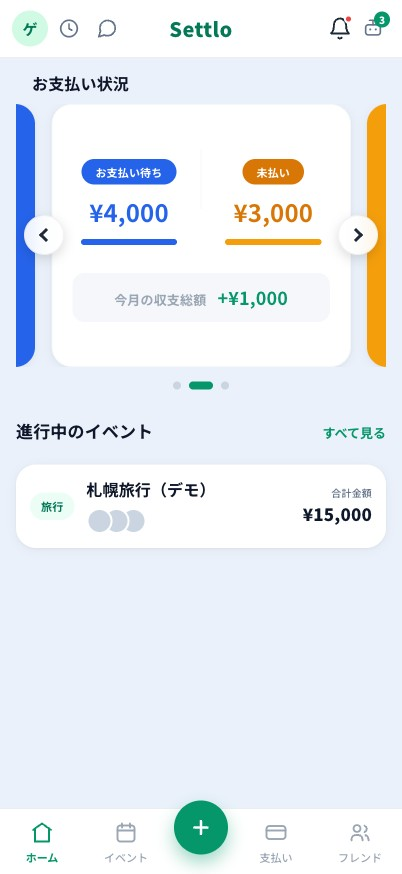
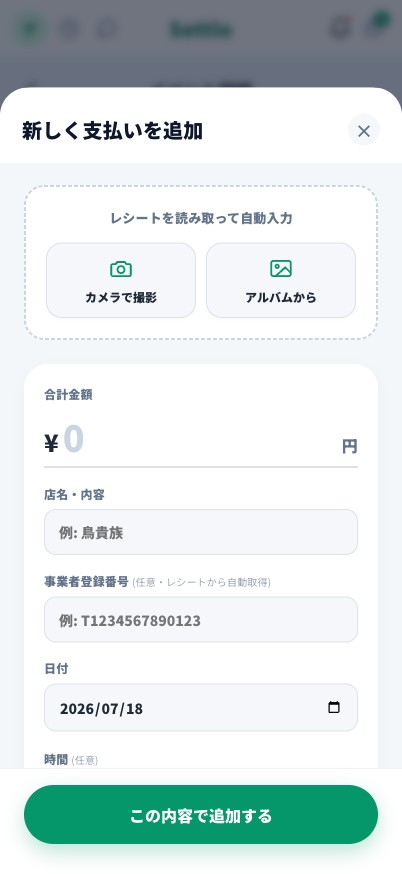
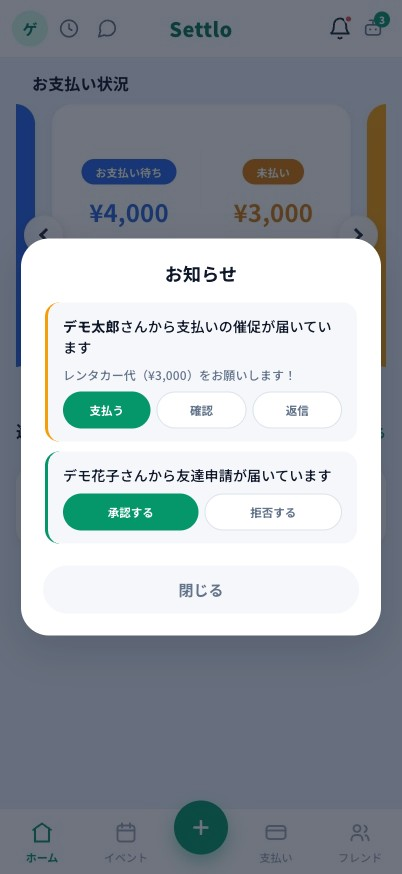

# Settlo（セトロ）

> レシートを撮るだけ。グループの「割り勘」と「精算」を、もう迷わせない。

**Settlo** は、旅行・飲み会・イベントなど、グループでの支払いを
**記録 → 自動精算 → 支払い** までシームレスにこなせる割り勘アプリです。

🔗 **公開URL： https://settlo-app.web.app**

---

## 📸 スクリーンショット

| ホーム | レシートAI読み取り | まとめて精算 | 通知・催促 |
|:---:|:---:|:---:|:---:|
|  |  |  |  |
| 支払い状況と進行中のイベントをひと目で確認 | 撮影するだけで店名・金額を自動入力 | 相手ごとの貸し借りを合算してまとめて精算 | 催促や友達申請をその場で処理 |

※ 画面はゲストデモ環境のサンプルデータです。

---

## ✨ 主な機能

- 🧾 **レシートAI読み取り** — 撮影するだけで店名・金額・品目を自動入力（Gemini OCR）
- 🍽️ **柔軟な割り勘** — 「全員で均等」「金額を指定」「商品ごとに支払う人を選ぶ」の3方式
- 🏷️ **支払いジャンル** — 食事・カフェ・コンビニ・交通など、支払いごとにアイコンで分類
- 🧮 **自動精算** — 「誰が誰にいくら払うか」を最小回数の送金で計算
- 👥 **イベント & 参加者管理** — 招待コードで参加、参加者やイベント内容の編集も可能
- 🤝 **フレンド & 取引履歴** — 申請・承認、相手との過去の取引を確認できる
- 🔔 **通知** — 承認リクエスト・催促・拒否をアプリ内＋プッシュで通知（一言メッセージも添えられる）
- 💬 **件ごとのチャット** — 「〇〇の支払いの件」単位で相談。既読・未読バッジつき、解決したら自動で片付く
- ✅ **承認待ちビュー** — 自分が承認する分・相手待ち・承認/拒否の履歴をひと目で。催促中は最上部に強調
- 📊 **精算の進捗表示** — イベントごとに「未精算の残り」と完了率を可視化
- 🎓 **チュートリアル & ボタンガイド** — 初回ガイドと、画面のボタンを1つずつ説明するツアー
- 🕹️ **ゲストデモ** — 登録なしでデモデータつきのお試し体験（ログイン画面から）
- 📱 **PWA対応** — ホーム画面に追加して単体アプリとして起動

---

## 🛠️ 技術スタック

| 領域 | 使用技術 |
|---|---|
| フロントエンド | Vue 3（`<script setup>`） / Vite |
| ルーティング | Vue Router（ハッシュルーティング） |
| バックエンド | Firebase（Authentication / Firestore / Cloud Functions / Hosting / FCM） |
| AI | Gemini 2.5 Flash（レシートOCR） |
| ホスティング | Firebase Hosting |

---

## 🚀 セットアップ（ローカル開発）

```sh
# 1. 依存関係をインストール
npm install

# 2. プロジェクト直下に .env.local を作成し、Firebase の設定（VITE_FIREBASE_*）を記述
#    ※ ファイル名が .env.dev だと Vite が読み込まないので注意（.env.local を使う）

# 3. 開発サーバーを起動
npm run dev          # → http://localhost:5173

# 本番ビルド
npm run build
```

> 設計・データモデル・開発メモは [開発メモ.md](./開発メモ.md)、
> やることリストは [TASKS.md](./TASKS.md) を参照してください。

---

## 📁 ディレクトリ構成（抜粋）

```
src/
├─ views/        # 画面（Home / Event / Money / Friend / Login など）
├─ components/   # UI部品（モーダル・カード・アイコン）
├─ composables/  # useSettlement（精算ロジック）など
├─ assets/       # base.css（デザイントークン）/ main.css
└─ firebase.js   # Firebase 初期化
functions/        # Cloud Functions（レシートOCR・精算API）
```

---

## 👥 開発

愛知工業大学の学生チームによる開発（**技育博2026 Vol.2** エントリー作品）。
サークル内ハッカソン「SysHack」での制作をきっかけに開発を継続中です。
